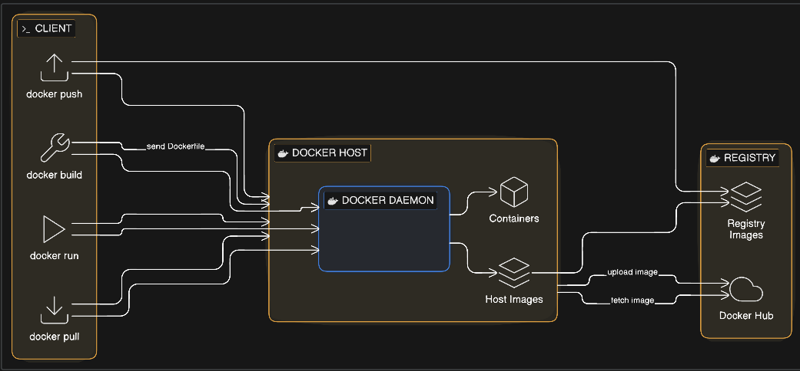

# Kubernetes
# 🐳 Docker Basics

## 📌 What is Docker?
- Docker is a platform used to build, package, and run applications in containers.  
- Example: Run a Node.js app without installing Node.js on your system.

---

## ⚖️ Difference Between Containers and Virtual Machines

| Feature          | Containers 🐳              | Virtual Machines 💻        |
|-----------------|--------------------------|----------------------------|
| Architecture    | Share host OS kernel      | Separate OS for each VM     |
| Size            | Lightweight (MBs)         | Heavy (GBs)                 |
| Startup Time    | Fast (seconds)            | Slow (minutes)              |
| Performance     | High (low overhead)       | Lower (high overhead)       |
| Resource Usage  | Efficient                 | More resource consumption   |

---

## 🏗️ Docker Architecture (Process Explained)

- **Docker Client**
  - User interacts using commands like `docker run`, `docker build`, `docker pull`
  - Sends requests to Docker Daemon

- **Docker Host**
  - System where Docker is installed
  - Contains Docker Daemon, Containers, and Images

- **Docker Daemon**
  - Core engine of Docker
  - Builds images, runs containers, manages resources

- **Docker Images**
  - Read-only templates used to create containers
  - Example: Ubuntu, Node.js

- **Docker Containers**
  - Running instances of Docker images
  - Lightweight and isolated environments

- **Docker Registry**
  - Stores Docker images
  - Example: Docker Hub
  - Used to push and pull images

---

## 🔄 Docker Workflow

- Write a **Dockerfile**
- Run `docker build` → Creates an image  
- Run `docker run` → Starts a container  
- Use `docker push/pull` → Interact with Docker Hub
- 
